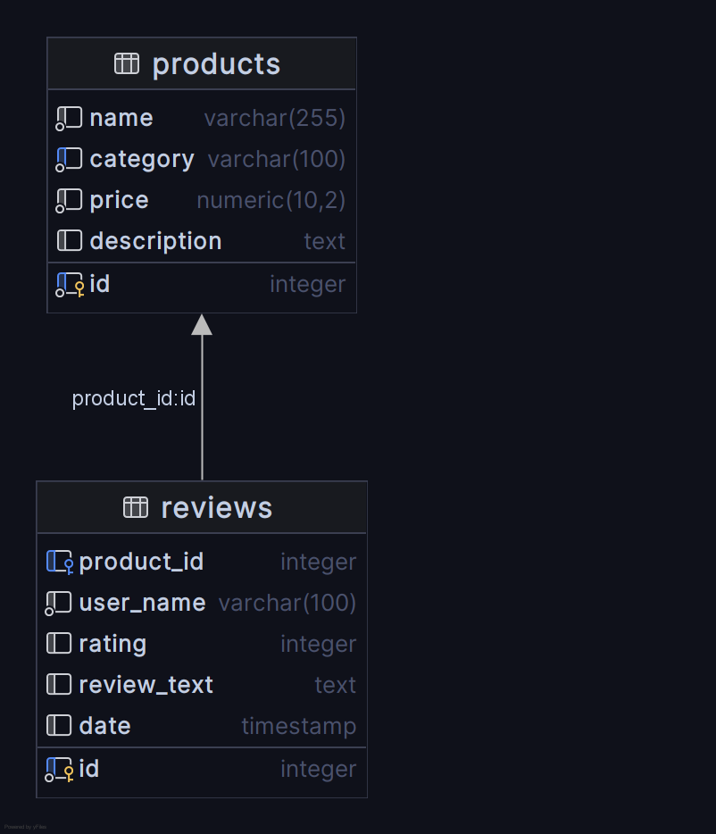

# NoSQL vs SQL Database Comparison Report
**Author**: Benjamin Wuermli  
**Date**: June 14, 2025  
**Course**: Datenbankdesign und Implementierung (ddi)

## Summary

This report compares MongoDB (NoSQL) and PostgreSQL (SQL) for an e-commerce product review system. With 10,000 products with between 0 to 55 reviews per product.  
Performance patterns, querie complexities and flexibility show each database's strengths and weakneses.

**Key Finding**: MongoDB excels at pre-aggregated data and simple lookups, while PostgreSQL is better for indexed filtering, complex queries and situations where structured data is crutial.

## Problem Description

**Use Case**: E-commerce product catalog with user reviews

**Data Volume**:  
- 10,000 products across 5 categories (Electronics, Books, Clothing, Home, Sports)  
- 283,887 user reviews (average 28 reviews per product)  
- Relationship: One-to-many (Product → Reviews)  

**Why NoSQL Makes Sense**:  
- Products have varying attributes by category  
- Reviews naturally nest within products  
- Read-heavy workload (browsing > purchasing)  
- Flexible schema for different product types  

Furthermore, MongoDB's schema-less nature shuld provide significant advantages in adapting to evolving data requirements. Unlike relational databases, where adding a new attribute requires altering the table schema, MongoDB allows you to simply add the new field to the relevant documents without affecting existing data. This flexibility is beneficial in this environment where product catalogs are constantly changing and new attributes are frequently introduced.  
For example, if we wanted to add a "color" attribute to only the "Clothing" category, we could do so without modifying the structure of documents in other categories.


## Conceptual Model

**Relationship**: One-to-Many (1:N)  
- One PRODUCT can have many REVIEWS  
- One REVIEW belongs to exactly one PRODUCT  
- Foreign Key: REVIEW.product_id → PRODUCT.id  

**Further Rules**:
- Products must have unique IDs  
- Reviews must reference existing products  
- Ratings constrained to 1-5 scale  
- Review must have dates  




## Database Implementations

### PostgreSQL (SQL) Design
```sql
CREATE TABLE products (
    id SERIAL PRIMARY KEY,
    name VARCHAR(255) NOT NULL,
    category VARCHAR(100) NOT NULL,
    price DECIMAL(10,2) NOT NULL,
    description TEXT
);

CREATE TABLE reviews (
    id SERIAL PRIMARY KEY,
    product_id INTEGER REFERENCES products(id),
    user_name VARCHAR(100) NOT NULL,
    rating INTEGER CHECK (rating >= 1 AND rating <= 5),
    review_text TEXT,
    date TIMESTAMP DEFAULT CURRENT_TIMESTAMP
);

CREATE INDEX idx_reviews_product_id ON reviews(product_id);
CREATE INDEX idx_products_category ON products(category);
```
- **Foreign Key**: reviews.product_id → products.id
- **Indexes**: On product_id, category

### MongoDB (NoSQL) Design
```javascript
{
  "_id": 1,
  "name": "Product Name",
  "category": "Electronics",
  "price": 299.99,
  "description": "Product description",
  "reviews": [
    {
      "id": 1,
      "user_name": "john_doe",
      "rating": 5,
      "review_text": "Great product!",
      "date": "2024-06-01T10:00:00Z"
    }
  ],
  "avg_rating": 4.2,
  "review_count": 15
}
```
- **Embedded**: Reviews within products
- **Pre-calculated**: Average ratings and counts

## Performance Results


### Query Performance Comparison

| Operation                       | MongoDB (ms) | PostgreSQL (ms) | Winner      | Speedup   |
| ------------------------------- | ------------ | --------------- | ----------- | --------- |
| Get Average Ratings             | 0.0169       | 0.0806          | MongoDB     | 4.77x     |
| Get Product with Reviews        | 0.0006       | 0.0005          | PostgreSQL  | 1.20x     |
| Get Products by Category        | 0.0615       | 0.0022          | PostgreSQL  | 27.95x    |
| Get Products by Price Range     | 0.0081       | 0.0409          | MongoDB     | 5.05x     |
| Get Products with High Ratings  | 0.0071       | 0.0739          | MongoDB     | 10.41x    |
| Get Products with Keyword Reviews | 0.3024       | 0.0432          | PostgreSQL  | 7.00x   |


## Query Complexity Analysis

### MongoDB Advantages (Complexity = 1)
```javascript
// Get product with all reviews - Single query
db.products.find({"_id": 1})

// Get average ratings
db.products.find({}, {"avg_rating": 1, "review_count": 1})

// Get products with keyword reviews
db.products.find({"reviews.review_text": {"$regex": keyword, "$options":"i"}})
```

### PostgreSQL Complexity (Complexity = 2-3)
```sql
-- Get product with reviews - JOIN required
SELECT p.*, r.user_name, r.rating, r.review_text 
FROM products p 
LEFT JOIN reviews r ON p.id = r.product_id 
WHERE p.id = 1;

-- Get average ratings - Complex aggregation
SELECT p.id, p.name, AVG(r.rating), COUNT(r.id)
FROM products p 
LEFT JOIN reviews r ON p.id = r.product_id 
GROUP BY p.id, p.name;

-- Get products with keyword reviews
SELECT p.*
FROM products p
WHERE EXISTS (
    SELECT 1
    FROM reviews r
    WHERE r.product_id = p.id
    AND r.review_text LIKE %s
-- with parameter "%" + keyword + "%"
```

## Schema Flexibility

### Adding New Product Attributes

**PostgreSQL Process:**  
1. `ALTER TABLE products ADD COLUMN brand VARCHAR(100);`  
2. `ALTER TABLE products ADD COLUMN weight DECIMAL(10,2);`  
3. Update application code (Models)  
4. Potentialy many empty fields n the database  

**MongoDB Process:**  
1. Insert document with new fields.

**Winner**: MongoDB - No schema migrations needed

## Measurement Criteria Summary

### 1. Query Performance
- **Mixed Results**: Each database excels in different scenarios
- **MongoDB**: Better for embedded data access and pre-aggregated values
- **PostgreSQL**: Superior for indexed filtering and complex joins

### 2. Query Complexity
- **Winner**: MongoDB
- **Reason**: Simpler queries for nested data structures

### 3. Schema Flexibility
- **Winner**: MongoDB
- **Reason**: Dynamic schema, no migrations required

## Conclusions and Recommendations

### When to Choose MongoDB:
✅ **Rapid development** - Flexible schema accelerates prototyping  
✅ **Document-oriented data** - Products with varying attributes  
✅ **Read-heavy workloads** - Pre-calculated aggregations  
✅ **Simple queries** - Embedded data reduces complexity  
✅ **Horizontal scaling** - Built-in sharding capabilities  

### When to Choose PostgreSQL:
✅ **Complex analytics** - Superior aggregation performance  
✅ **Strong consistency** - ACID compliance guaranteed  
✅ **Efficient filtering** - Excellent index performance  

### For This E-commerce Use Case:

**Recommendation**: **MongoDB** for the following reasons:

1. **Development Speed**: Schema flexibility is crucial for evolving product catalogs.
2. **Natural Data Model**: Products with embedded reviews match business logic.
3. **Read Performance**: Faster for common operations (product browsing, ratings).

**However**, consider PostgreSQL if:  
- Complex reporting and analytics are primary requirements  
- Team has strong SQL expertise  

## Personal Reflection

### Database Experience
I have Basic knowledge of MongoDb and SQL, mainly from Grundlagen Datenbanken (gdb).

### Key Learning
The most important insight was seeing how data modeling decisions impact performance. MongoDB's denormalized approach trades storage for query simplicity, while PostgreSQL's normalization optimizes for consistency and complex operations.

### Performance vs Complexity Trade-off
MongoDB's simpler queries can perform better for common operations, but PostgreSQL's sophisticated query optimizer excels at complex analytical workloads.